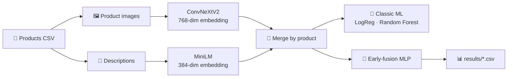

# 🛒 Multimodal Product Classifier

> Classifying **BestBuy.com** products into categories by combining what they **look like** 🖼️ and what they **say** 📝.


Every product has an **image** and a **text description**. This project turns both into embeddings with pre-trained deep learning models, then trains classic ML models and a multimodal neural network to predict the product category.

---

## ✨ Highlights

- 🖼️ **Image embeddings** with **ConvNeXtV2** (Hugging Face) or **ResNet / DenseNet / Inception** (Keras)
- 📝 **Text embeddings** with **all-MiniLM-L6-v2** (Sentence Transformers), with optional OpenAI embeddings
- 🌲 **Classic ML baselines**: Logistic Regression and Random Forest
- 🧠 **Early-fusion MLP** that concatenates text and image features
- 📊 **PCA / t-SNE** visualizations of the embedding space
- ✅ **19 unit tests**, all passing

---

## 🏆 Results

### 🧠 MLP (early fusion)

| Model | 🎯 Accuracy | ⚖️ Macro F1 | Target (Acc / F1) |
|---|:---:|:---:|:---:|
| 🖼️ Image only | **0.823** | **0.746** | 0.75 / 0.70 ✅ |
| 📝 Text only | **0.930** | **0.872** | 0.85 / 0.80 ✅ |
| 🔀 Multimodal | **0.918** | **0.851** | 0.85 / 0.80 ✅ |

### 🌲 Classic ML (accuracy / weighted F1)

| Features | Logistic Regression | Random Forest |
|---|:---:|:---:|
| 📝 Text | 0.901 / 0.899 | 0.907 / 0.903 |
| 🖼️ Image | 0.792 / 0.792 | 0.802 / 0.794 |
| 🔀 Text + Image | 0.894 / 0.894 | 0.899 / 0.893 |

> 💡 Text carries most of the signal. Images alone still reach ~82% accuracy.

---

## 🔄 How it works



1. **📥 Data**: ~50k products, each with an image and a description.
2. **🖼️ Image embeddings**: a frozen vision backbone plus pooling turns each image into a vector.
3. **📝 Text embeddings**: MiniLM with mean pooling over tokens turns each description into a vector.
4. **🔗 Merge**: text and image features are joined by product (`text_*` and `image_*` columns).
5. **🌲 Classic ML**: sklearn baselines on text only, image only, and both combined.
6. **🧠 MLP**: Dense → BatchNorm → Dropout blocks, trained with class weights, Adam and early stopping.

---

## 📁 Project structure

```
📦 Multimodal-Product-Classifier
├── 📓 AnyoneAI - Sprint Project 04.ipynb   # main notebook (end-to-end run, with outputs)
├── 📓 preprocessing(optional).ipynb        # optional data preparation
├── 📂 src/
│   ├── 🖼️ vision_embeddings_tf.py   # image loading + foundational CV models
│   ├── 📝 nlp_models.py             # Hugging Face & OpenAI text embeddings
│   ├── 🧰 utils.py                  # merging, image download, train/test split
│   ├── 🌲 classifiers_classic_ml.py # PCA/t-SNE plots + sklearn models
│   └── 🧠 classifiers_mlp.py        # Keras dataset, early-fusion MLP, training
├── 🧪 tests/                         # pytest suite
├── 📊 results/                       # test-set predictions for each MLP
├── 🐳 Dockerfile
└── 📋 requirements*.txt
```

---

## 🚀 Getting started

### 1️⃣ Install

**🐳 Docker**

```bash
docker build -t multimodal-classifier .
docker run -p 8888:8888 -v $(pwd):/app multimodal-classifier
```

**🐍 pip** (Linux / CPU)

```bash
pip install -r requirements.txt
```

**🍎 macOS (Apple Silicon)**

```bash
pip install -r requirements_mac.txt
```

**🪟 Windows + NVIDIA GPU**: see [the GPU guide below](#-windows--nvidia-gpu).

### 2️⃣ Get the data

The dataset and images are **not** in the repo because they are too large.

1. Place `processed_products_with_images.csv` in `data/`.
2. [Download the images](https://drive.google.com/file/d/14s2aDNTEWse86cWyLhvVIKmob6EbQrm_/view?usp=sharing) and extract them to `data/images/`.

### 3️⃣ Run

Open the notebook and run it from top to bottom:

```bash
jupyter notebook "AnyoneAI - Sprint Project 04.ipynb"
```

⏱️ On a GTX 1060, image embeddings take about 20–50 min, text embeddings about 10 min, and each MLP a few minutes.

### 4️⃣ Test

```bash
pytest tests/ --disable-warnings
```

---

## 🪟 Windows + NVIDIA GPU

TensorFlow **2.10** is the last version with native GPU support on Windows, so use **Python 3.10**:

```bash
py -3.10 -m venv .venv
.venv\Scripts\activate
pip install -r requirements_windows_gpu.txt
```

The CUDA 11 / cuDNN 8 runtime comes from the `nvidia-*-cu11` pip packages. TensorFlow finds those DLLs only if their `bin` folders are on `PATH`. It also needs `ptxas.exe`: without it, the process **crashes on the first GPU forward pass** 💥. To fix both, add this `sitecustomize.py` to the venv's `site-packages`:

```python
import os, glob
_nvidia = os.path.join(os.path.dirname(__file__), "nvidia")
_dirs = glob.glob(os.path.join(_nvidia, "*", "bin"))
os.environ["PATH"] = os.pathsep.join(_dirs + [os.environ.get("PATH", "")])
for _d in _dirs:
    os.add_dll_directory(_d)
os.environ.setdefault("XLA_FLAGS", "--xla_gpu_cuda_data_dir=" + os.path.join(_nvidia, "cuda_nvcc").replace("\\", "/"))
```

✅ To check that TensorFlow sees the GPU:

```bash
python -c "import tensorflow as tf; print(tf.config.list_physical_devices('GPU'))"
```

> ⚠️ If Windows **Smart App Control** is enabled, it may block the TensorFlow / PyTorch DLLs.

---

## 🧩 Supported backbones

| Type | Models |
|---|---|
| 🖼️ Keras | `resnet50`, `resnet101`, `densenet121`, `densenet169`, `inception_v3` |
| 🤗 Transformers | `convnextv2_tiny` / `base` / `large`, `swin_tiny` / `small` / `base`, `vit_base` / `large` |
| 📝 Text | any Hugging Face encoder (default `sentence-transformers/all-MiniLM-L6-v2`), OpenAI `text-embedding-3-small` |

---

## 🙏 Acknowledgements

- 🎓 Built as a sprint project for the **AnyoneAI – Data Science & ML Developer Career**.
- 🛒 Product data from **BestBuy.com** (see `data/Raw/LICENSE`).
- 🤗 Pre-trained models from **Hugging Face** and **Keras Applications**.
